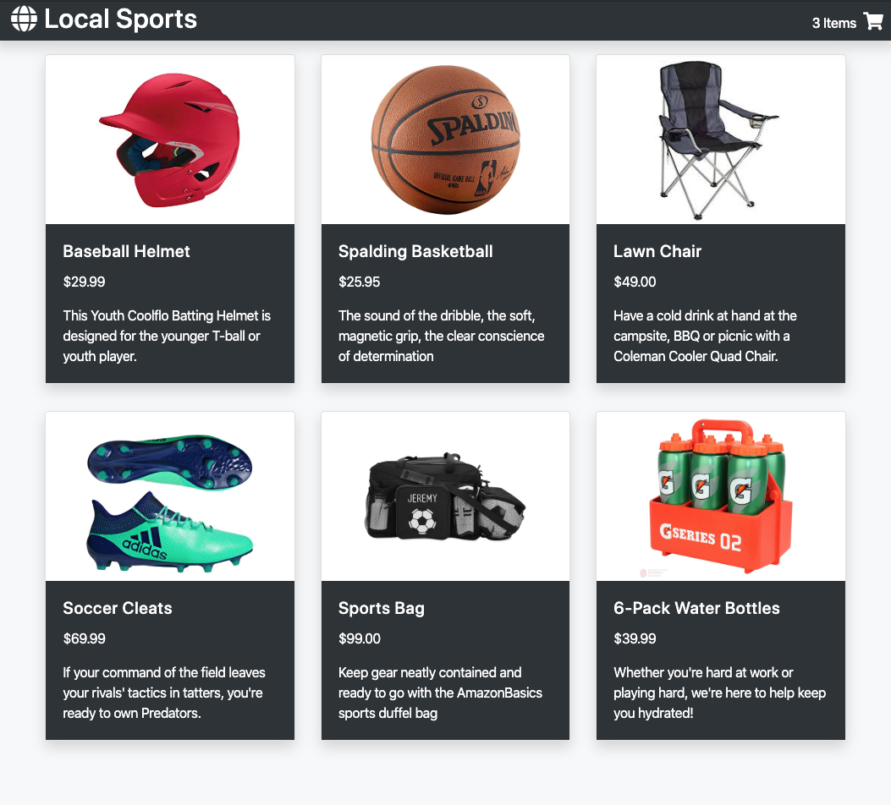

# shopping-cart

A full stack LAMP & React shopping cart app focused on athletic gear

Designed for Desktop

## Technologies
- React.js
- Webpack4
- Babel
- Node
- HTML5
- CSS3
- BootStrap
- AWS EC2

## Feature List
- User can view items in catalog
- User can select an item to view detailed information
- User can add the item to their shopping cart
- User can view their shopping cart
- User can remove items from their shopping cart
- User can place an order from the shopping cart checkout

## DEMO

A functional demo can be seen at: https://shoppingcart.tomascormons.tech

## Example
Desktop View

Mobile View

## Development
### System Requirements
- NPM 6 or higher
- MYSQL 7 or higher

### Inital Setup
- Clone Repository History

`git clone https://github.com/Tcormons/local-sports.git`

- Install dependencies for NPM

`npm install`

- Import the database for MYSQL

`npm run db:import`

- Run Dev enviornment

`npm run dev`

### localhost:3000

> - Maintained by: `tcormons`
